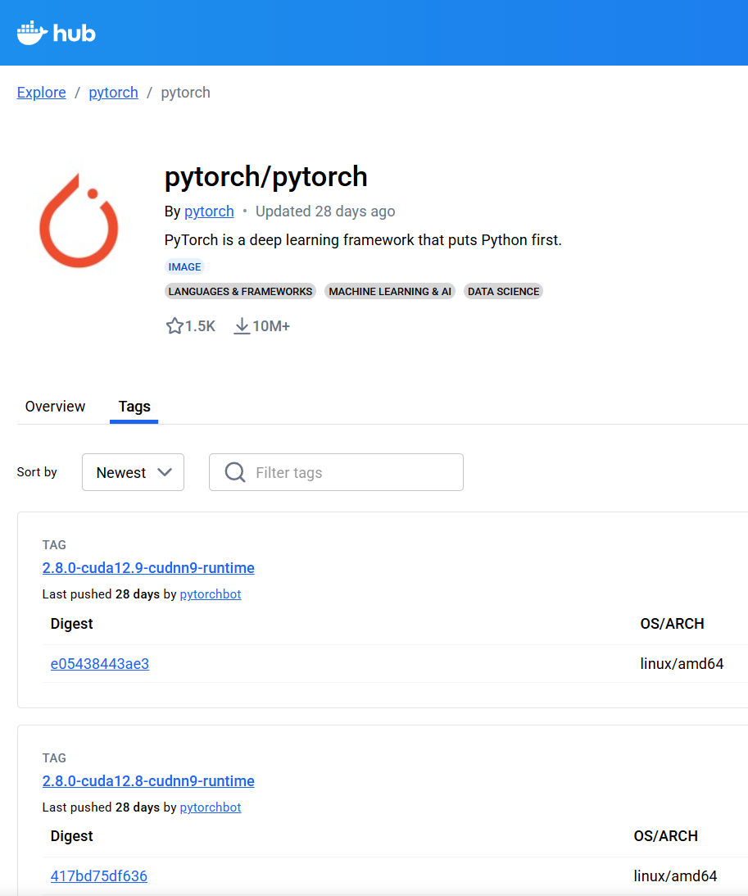

# Docker를 이용한 Deep Learning 환경 구축
Docker 환경에서 Deep Learning 환경 구축 방법에 대해 설명한다. 여기서는 Deep Learning 프레임워크로 PyTorch를 사용한다.

## PyTorch Image 가져오기
1. [Docker Hub](https://hub.docker.com/)에서 **pytorch/pytorch**를 검색한다.
2. **Tags** 탭에서 설치를 원하는 Tag를 확인한다.

여기서는 예시로, **2.8.0-cuda12.9-cudnn9-runtime**를 사용한다.
3. **Windows PowerShell**을 열고, PyTorch Image를 Pull한다. 그러면, PyTorch 이미지를 Docker Hub에서 다운로드한다.
```powershell
docker pull pytorch/pytorch:2.8.0-cuda12.9-cudnn9-runtime
```
4. Docker Image를 실행한다. 다음 명령은 PyTorch Image를 실행하고 Python을 실행시켜 PyTorch 함수를 호출한다.
```powershell
docker run --gpus all -it --rm pytorch/pytorch:2.8.0-cuda12.9-cudnn9-runtime python -c "import torch; print(torch.cuda.is_available())"
```