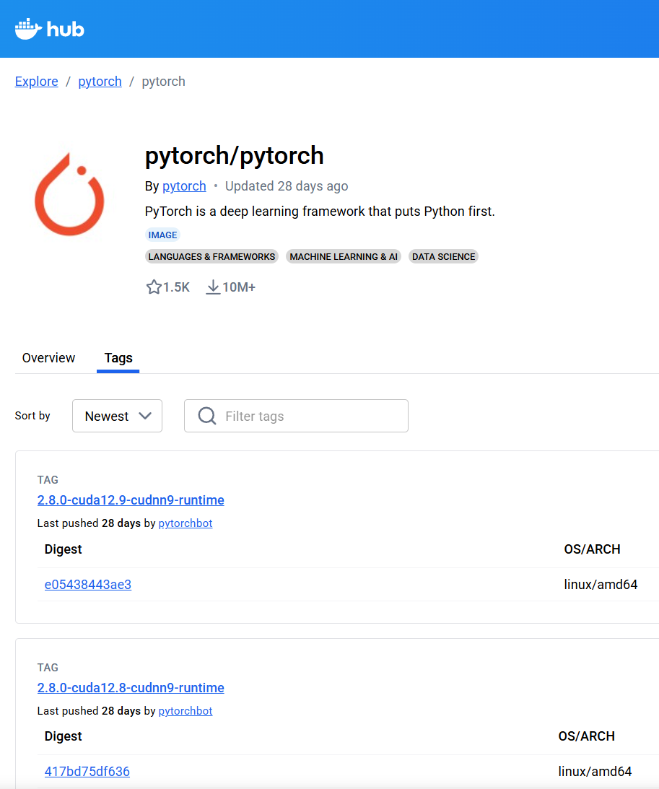

# Docker를 이용한 Deep Learning 환경 구축
Docker 환경에서 Deep Learning 환경 구축 방법에 대해 설명한다. 여기서는 Deep Learning 프레임워크로 PyTorch를 사용한다.

## PyTorch Image 가져오기
1. [Docker Hub](https://hub.docker.com/)에서 **pytorch/pytorch**를 검색한다.
2. **Tags** 탭에서 설치를 원하는 Tag를 확인한다.

여기서는 예시로, **2.8.0-cuda12.9-cudnn9-runtime**를 사용한다.
3. **Windows PowerShell**을 열고, PyTorch Image를 Pull한다. 그러면, PyTorch 이미지를 Docker Hub에서 다운로드한다.
```powershell
docker pull pytorch/pytorch:2.8.0-cuda12.9-cudnn9-runtime
```
4. Docker Image를 실행한다. 다음 명령은 PyTorch Image를 실행하고 Python을 실행시켜 PyTorch 함수를 호출한다.
```powershell
docker run --gpus all -it --rm pytorch/pytorch:2.8.0-cuda12.9-cudnn9-runtime python -c "import torch; print(torch.cuda.is_available())"
```

5. Python을 실행하지 않고 쉘로만 접근하기 위해서는 다음과 같이 한다.
```powershell
docker run --name <NAME> --gpus all -it -v ${PWD}:/workspace pytorch/pytorch:2.8.0-cuda12.9-cudnn9-runtime
```

## Dockerfile 구축
1. 소스코드가 있는 폴더에 Dockerfile을 만든다.
```
FROM pytorch/pytorch:2.8.0-cuda12.9-cudnn9-runtime

WORKDIR /workspace

RUN apt-get update && apt-get install -y \
    git \
    wget \
    curl \
    && rm -rf /var/lib/apt/lists/*

RUN pip install --upgrade pip

CMD ["/bin/bash"]
```

2. Dockerfile과 같은 위치에 docker-compose.yml 파일을 만든다. 이때, **app**는 서비스 이름, **mp-net**은 컨테이너 이름이다.
```
services:
  app:
    build: .
    container_name: mp-net
    volumes:
      - .:/workspace
    working_dir: /workspace
    stdin_open: true
    tty: true
    shm_size: "8gb"
    deploy:
      resources:
        reservations:
          devices:
            - driver: nvidia
              count: all
              capabilities: [gpu]
```

3. 다음 명령을 실행하면, 도커 이미지가 만들어진다.
```powershell
docker compose build
```

4. 컨테이너를 실행한다. 이때, **app**는 서비스 이름이다.
```powershell
docker compose run app
```

## Visual Studio Code에서 연결
1. Dockerfile 파일과 docker-compose.yml 파일이 있는 폴더로 이동한다.

2. 다음 명령을 실행한다. 이는 컨테이너를 백그라운드 모드로 실행한다.
```powershell
docker compose up -d
```

3. Visual Studio Code를 실행한다.