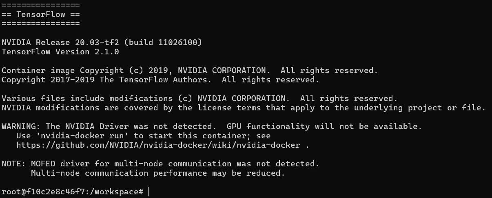

# 윈도우즈에서 WSL 기반 Docker 설치
윈도우즈에서 도커 기반 개발 환경을 설정하는 방법에 대해 설명합니다.

## WSL 설치
참고: [WSL을 사용하여 Windows에 Linux를 설치하는 방법](https://learn.microsoft.com/ko-kr/windows/wsl/install)

1. **관리자 모드**에서 **PowerShell** 또는 **Windows 명령 프롬프트**를 연다.
2. 프롬프트에 다음과 같이 명령어를 입력한다.
```powershell
wsl --install
```
3. 설치 시, **오류 코드: Wsl/InstallDistro/Service/RegisterDistro/CreateVm/HCS/HCS_E_SERVICE_NOT_AVAILABLE** 오류가 발생할 수 있다. 이는 윈도우즈에 필요한 기능이 비활성화 되어있을 때 주로 발생한다. 이 경우, 프롬프트에 다음과 같이 명령어를 입력하여, 기능을 활성화한다. 설치가 끝나면 컴퓨터를 재부팅한다. 그리고 다시 WSL 설치를 시도해본다.
```powershell
dism.exe /online /enable-feature /featurename:Microsoft-Windows-Subsystem-Linux /all /norestart
dism.exe /online /enable-feature /featurename:VirtualMachinePlatform /all /norestart
dism.exe /online /enable-feature /featurename:Microsoft-Hyper-V-All /all /norestart
```
4. Ubuntu가 기본적으로 설치되고, 설치 시, 계정(user account)과 암호(password)를 설정한다.
5. WSL 설치가 끝나면 컴퓨터를 재부팅한다.

## Docker 설치
참고: [WSL 2에서 Docker 원격 컨테이너 시작](https://learn.microsoft.com/ko-kr/windows/wsl/tutorials/wsl-containers)

1. [Docker Desktop](https://docs.docker.com/desktop/features/wsl/#turn-on-docker-desktop-wsl-2)를 다운로드하고 설치한다. 그러면 Docker가 함께 설치된다.
   - "Use WSL 2 instead of Hyper-V (recommended)"를 선택한다.
   - Docker Desktop을 이용하기 위해서는 회원가입을 해야한다.
2. Docker Desktop를 실행하고, **Settings** > **General** 탭으로 이동한다.
4. **General** 탭에서 **Use the WSL 2 based engine**을 선택한다. 그리고 **Apply** 버튼을 누른다.
5. **Settings** > **Resources** > **WSL integration** 탭으로 이동한다.
6. **WSL integration** 탭에서 **Enable integration with my default WSL distro**를 선택한다. 그리고 **Apply** 버튼을 누른다.
7. Docker가 설치되었는지 확인해보자. Docker는 *PowerShell*이나 *Windows 명령 프롬프트*에서 직접 실행할 수 있다. 또는 *WSL*을 실행하여, 그곳에서 실행할 수 있다. 여기서는 *PowerShell*에서 실행하도록 하겠다. **PowerShell**을 연다.
8. 프롬프트에 다음과 같이 명령어를 입력한다. 그러면 Docker 버전을 확인할 수 있다.
```powershell
docker --version
```
9. 간단한 Docker 이미지를 실행해보자.
```powershell
docker run hello-world
```

## GPU 가속 확인
참고: [WSL에서 ML을 위한 GPU 가속을 시작하세요](https://learn.microsoft.com/ko-kr/windows/wsl/tutorials/gpu-compute)

최신 WSL2에서는 별도의 설정 없이 Docker에서 GPU를 바로 이용할 수 있다. 여기서는 NVIDIA NGC TensorFlow 컨테이너에서 GPU를 사용해 미리 학습된 모델을 실행해 보겠다.

1. 프롬프트에 다음과 같이 명령어를 입력한다. 그러면 Docker 이미지를 다운로드 받고 실행한다. 그러면 아래 그림과 같이 Ubuntu 프롬프트가 보인다.
```powershell
docker run --gpus all -it --shm-size=1g --ulimit memlock=-1 --ulimit stack=67108864 nvcr.io/nvidia/tensorflow:20.03-tf2-py3
```

2. 프롬프트에서 다음과 같이 명령어를 입력한다.
```powershell
cd nvidia-examples/cnn/
python resnet.py --batch_size=64
```
3. 실행이 끝나면 GPU 사용 여부 확인을 위해 프롬프트에 다음과 같이 명령어를 입력한다.
```powershell
nvidia-smi
```